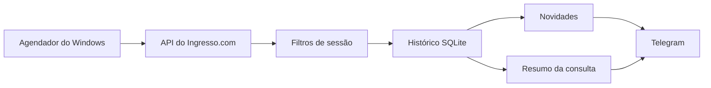

# Heimdall

Monitor de sessões de cinema em Python, com histórico em SQLite e avisos pelo Telegram.

## De onde veio a ideia

Eu queria assistir ao relançamento de *Vingadores: Ultimato* em Campinas, numa sessão **Infinity Vision e legendada**. Encontrei sessões com cada uma dessas características, mas nenhuma com as duas juntas.

Como a programação poderia mudar até a estreia, decidi desenvolver o Heimdall para acompanhar essa busca. Aproveitei essa necessidade para colocar os estudos em prática e construir uma ferramenta que eu pudesse usar no dia a dia.

O programa consulta a programação, aplica os filtros e compara o resultado com o histórico. Quando aparece uma sessão compatível, envia um aviso pelo Telegram. Também pode enviar um resumo de cada consulta, para acompanhar se a rotina está funcionando.

## A busca na prática

Na captura de **07/09/2026**, o Ingresso.com retornou **137 sessões**: 39 com Infinity Vision e 35 legendadas. Nenhuma reunia os dois critérios.

| Cinema | Sessão de 24/09 | Características | Resultado |
| --- | --- | --- | --- |
| Cine Araújo Multiplex Parque Das Bandeiras | 16h00 | Infinity Vision + Dublado | Falta Legendado |
| Kinoplex Dom Pedro | 20h30 | IMAX + Legendado | Falta Infinity Vision |

A validação incluiu 39 sessões na página do filme, em duas datas. Os IDs, cinemas, horários e rótulos visíveis coincidiam com a API. Um detalhe precisou de ajuste na comparação: o rótulo `Normal` vinha na resposta com `display=false`, por isso não aparecia no site.

Os [registros dessa consulta](examples/historico/README.md) estão no repositório e podem ser analisados offline.

## Rodar localmente

Requer **Python 3.11+**. O projeto usa a biblioteca padrão do Python. No PowerShell, dentro da pasta do repositório:

```powershell
python -m venv .venv
.\.venv\Scripts\python.exe -m heimdall analisar
```

O comando lê a captura de 07/09 e retorna `Sessões na captura: 137 | Compatíveis: 0`. A avaliação usa a data da coleta, então o resultado pode ser reproduzido mesmo depois da estreia. Use `--listar` para ver as sessões e os motivos de rejeição.

Para registrar a captura em um banco de estudo:

```powershell
.\.venv\Scripts\python.exe -m heimdall registrar --arquivo examples/historico/api-2026-09-07.json --banco data/demo.sqlite3
.\.venv\Scripts\python.exe -m heimdall historico --banco data/demo.sqlite3
```

Em um banco novo, serão registradas 137 sessões e nenhum evento compatível. Repetir a captura mantém o histórico sem duplicar as sessões.

Para consultar a programação online:

```powershell
.\.venv\Scripts\python.exe -m heimdall consultar
```

A busca fica em [config/perfil.toml](config/perfil.toml): filme `32174`, Campinas e período de **24/09 a 01/10/2026**. Ajuste o perfil para acompanhar outro filme ou período. A configuração do bot e do agendamento está em [Operação](docs/OPERACAO.md).

## Acompanhamento pelo Telegram

No ciclo de **15/09/2026 às 16h01**, o monitor retornou 145 sessões, ainda sem correspondência, e o Telegram confirmou o envio do resumo. Este recorte foi reconstituído a partir do registro desse ciclo:

```text
HEIMDALL — RESUMO DA CONSULTA #2
Vingadores: Ultimato Encore (Relançamento)
Campinas/SP | Infinity Vision + Legendado
Sessões de 24/09 a 01/10/2026

Concluída em 15/09/2026 16:01:24 -0300
Sessões retornadas pela API: 145
Compatíveis com seus filtros: 0
IDs novos: 0 | Sessões alteradas: 0
Novidades compatíveis: 0
Datas publicadas no período: 7/8
Datas ainda não listadas: 01/10
```

O [registro do ciclo](examples/historico/ciclo-2026-09-15.json) e o [recorte em texto](examples/resumo-telegram.txt) estão em `examples/`. Quando há novidade compatível, o aviso inclui cinema, sala, horário e link de compra.

## Como funciona



A rotina começa com intervalo de 30 minutos. O SQLite guarda o que já foi encontrado e o estado dos avisos. Uma sessão conhecida também pode gerar novidade se passar a atender aos filtros. Em caso de falha, o monitor registra o problema e ajusta a próxima tentativa.

As [decisões técnicas](docs/ARQUITETURA.md) detalham a identificação de novidades, a fila de envio e a recuperação de falhas.

## Conhecimentos envolvidos

O desenvolvimento reuniu diferentes assuntos dos meus estudos, cada um ligado a uma necessidade do programa:

| Parte do projeto | Conhecimentos trabalhados |
| --- | --- |
| Consultar a programação | API HTTP, JSON e tratamento de erros |
| Aplicar os filtros | Regras de negócio, datas e fusos horários |
| Comparar consultas | SQLite, SQL e transações |
| Enviar avisos | Telegram Bot API e controle de entregas |
| Rodar periodicamente | Processos e Agendador de Tarefas do Windows |
| Validar o funcionamento | Testes automatizados, logs e Git |

## Testes

```powershell
.\.venv\Scripts\python.exe -m unittest discover -s tests
```

A suíte usa as capturas históricas e fixtures para exercitar situações como uma sessão compatível, timeout e interrupção durante o envio. A organização da suíte está em [Testes](docs/TESTES.md).

## Requisitos de operação

O acompanhamento depende da disponibilidade da [fonte de dados](docs/FONTE.md) e de um computador ligado, com internet e usuário conectado ao Windows. A credencial do Telegram é protegida pela DPAPI dessa conta.

O projeto identifica sessões com venda habilitada; a disponibilidade de assentos precisa ser conferida no checkout. Se um envio ficar sem confirmação, o lote é marcado como incerto para conferência antes de tentar novamente.

## Desenvolvimento

Desenvolvi o Heimdall por etapas, partindo da consulta à programação até chegar ao histórico em SQLite e aos avisos pelo Telegram. Meu objetivo foi construir algo útil enquanto estudava os conceitos envolvidos em cada parte da solução.

Usei o Codex como guia e parceiro de estudos ao longo desse processo, com explicações, referências e sugestões de código para apoiar a implementação. Também contei com seu auxílio para estruturar a arquitetura e elaborar a documentação.

Para explorar o código, comece por `heimdall/rules.py`, que contém os filtros. Depois veja `tracking.py` e `storage.py` para entender o histórico, e `notifications.py` e `monitor.py` para acompanhar os envios e a rotina.
